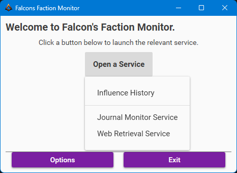
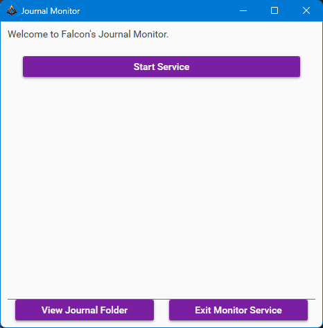
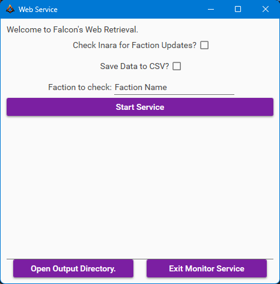
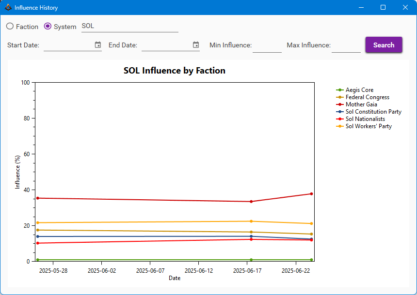
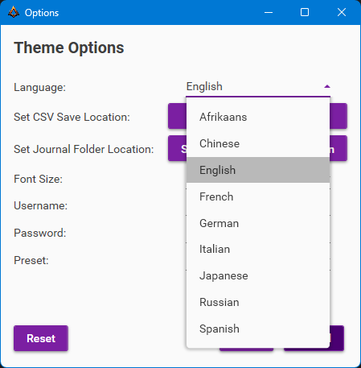
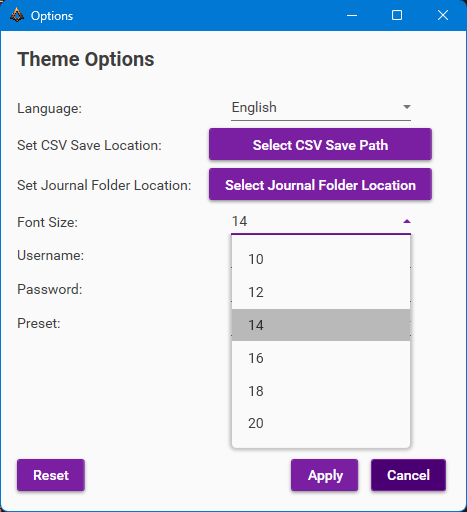
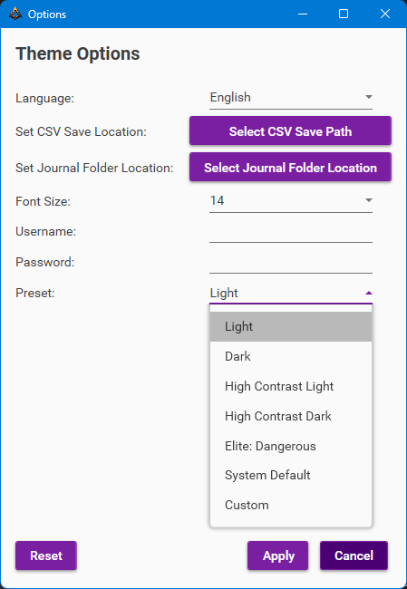
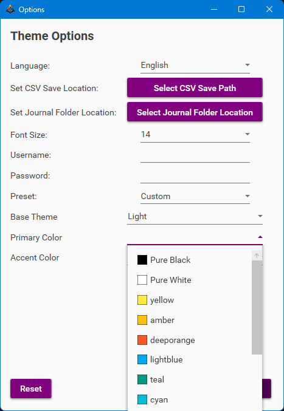

# FalconsFactionMonitor

## What is Falcons Faction Monitor?
A small program to retrieve data for factions in Elite Dangerous and perform analysis on them.

## Installation
Navigate to the [Latest Release](https://github.com/Falcon-Charade/FalconsFactionMonitor/releases/latest) and download the latest release setup file.
Follow the installation instructions provided in the setup wizard.

## Usage
### Running the Program
After installation, you can run the program by launching the application from your desktop or start menu.

### Main Menu
The main menu provides several options to interact with the program:
- **Influence History**: Opens the Influence History window to view and analyze faction data.
- **Journal Monitor Service**: Opens the Journal Monitor Service window to monitor Elite Dangerous journal files.
- **Web Retrieval Service**: Opens the Web Retrieval Service window to fetch faction data from the web.
- **Options**: Opens the settings window to configure various options for the program.
- **Exit**: Closes the program.

### Journal Monitor Service
The program includes a Journal Monitor Service that runs in the background to monitor your Elite Dangerous journal files.
The service will automatically detect changes in the journal files and update the faction data accordingly.
You can view the folder where the journal files are stored via the "View Journal Folder" button.

### Web Retrieval Service
The Web Retrieval Service allows you to fetch faction data from the web.
The service has an option to retrieve data from Inara.cz via the "Check Inara for Faction Updates" checkbox.
**However, please note that Inara.cz has a limit on the number of requests per hour.**
If you encounter issues with the Inara.cz service, you can disable it to allow the program to run without it, or wait until the limit resets.
There is also an option to save the retrieved data to a file for later use. You can enable this option with the "Save Data to CSV" checkbox.
You can view this data by clicking the "Open Output Directory" button, which will open the folder where the data is saved.

To use the Web Retrieval Service, simply supply the faction name you want to retrieve data for and click the "Start Service" button.

### Influence History
The Influence History window allows you to view and analyze the influence history of factions.
**This window is locked behind access, and you will need to save the correct username and password via the options menu to access it.**
There are two options available in this window:
- **Faction**: Searches the database for the faction you specify and displays its influence history in all the systems it is present in based on the filters you set.
- **System**: Searches the database for the system you specify and displays the influence history of all factions in that system based on the filters you set.

#### Filters
You can filter the influence history data by:
- **Date Range**: Specify a start and end date to filter the data.
- **Minimum Influence**: Set a minimum influence percentage to filter factions.
- **Maximum Influence**: Set a maximum influence percentage to filter factions.
- **Returned Results**: You can click the items in the list to show/hide them from the graph.

### Options
The Options window allows you to configure various settings for the program:
- **Language**: Select the language for the program interface. The following languages are available:
	- Afrikaans
	- Chinese
	- English
	- French
	- German
	- Italian
	- Japanese
	- Russian
	- Spanish

- **Select CSV Save Path**: Specify the folder where the Web Retrieval Service will save the retrieved data.
- **Select Journal Folder Location**: Specify the folder where your Elite Dangerous journal files are stored.
- **Font Size**: Adjust the font size for the program interface. Currently, the following font sizes are available:
	- 10
	- 12
	- 14
	- 16
	- 18
	- 20

- **Username and Password**: Set the username and password for accessing the Influence History window.
- **Preset**: Options for changing the theme of the program interface. The following presets are available:
	- Light
	- Dark
	- High Contrast Light
	- High Contrast Dark
	- Elite: Dangerous
	- System Default
	- Custom

	- **Custom Theme**: If you select the Custom preset, you can customize the theme colors by selecting the options from the dropdown lists.
		- Base Theme Color: The background of the program interface.
		- Primary Color: The primary color used for buttons.
		- Accent Color: Currently unused, but can be used for future features.
